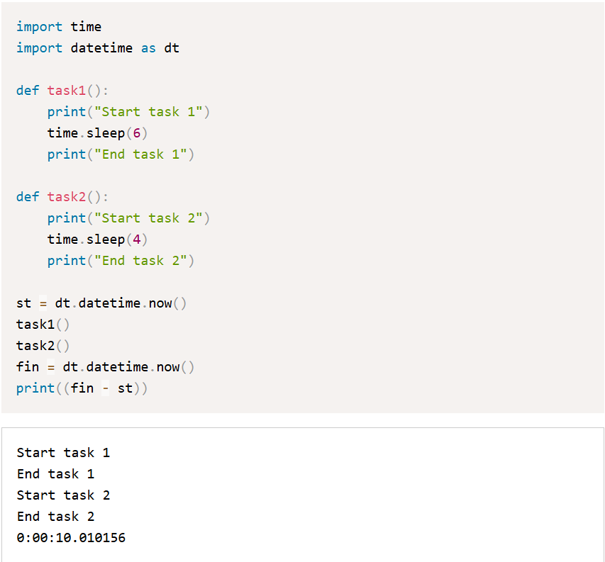
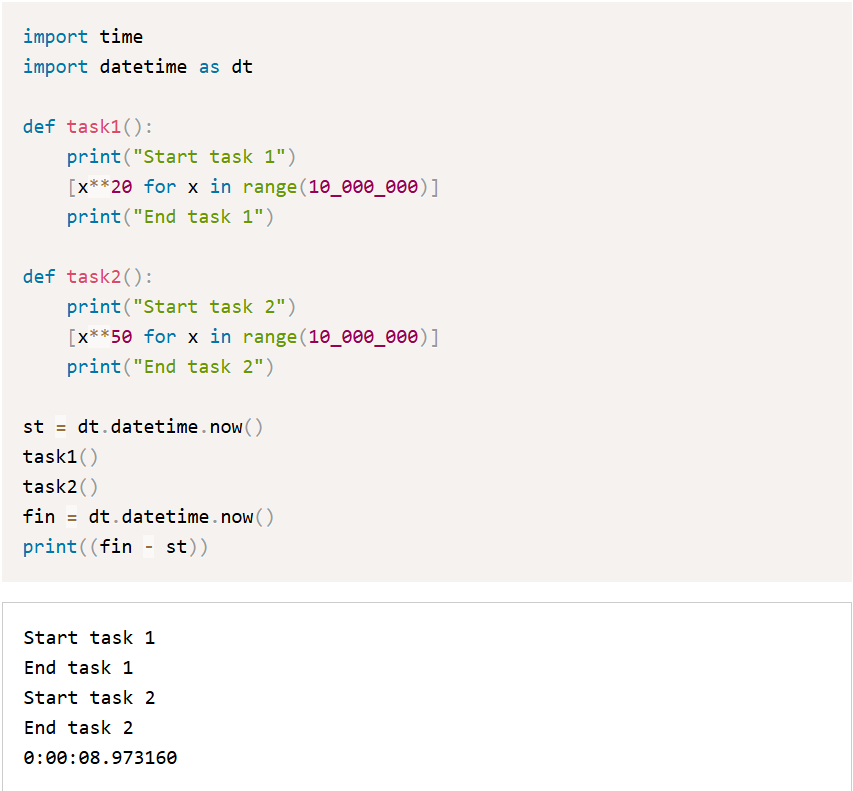

**Введение в асинхронное программирование**

**Введение**

Приветствуем на курсе по асинхронному программированию на Python! Мы все уже, надеюсь, умеем прекрасно писать синхронный код на Питоне, и это, в целом, решает большое количество задач, которые у нас есть, поэтому у некоторых из вас может возникнуть вопрос, а что это за зверь такой «асинхронное программирование», зачем оно вообще нужно, если мы и так до этого хорошо справлялись. В этом блоке уроков мы попробуем ответить на эти и другие вопросы, а также рассмотрим рассмотрим основные концепции асинхронного программирования и его отличия от синхронного (и еще от параллельного) выполнения кода. Понимание этих различий поможет нам лучше разобраться в преимуществах и особенностях асинхронного подхода.

**Разница между синхронным, асинхронным и параллельным выполнением кода**

**Синхронный код**

Начнем с того, в чем мы прекрасно разбираемся — с синхронного выполнения кода. Тут все ясно-понятно. Если говорить про Python, то при таком подходе наш любимый интерпретатор кушает наш прекрасный код последовательно строчка за строчкой. Прежде чем начать выполнение следующей операции, обязательно нужно завершить предыдущую.

Уверен, что пример синхронного кода приводить нет большого смысла, так как мы его писали тысячи раз, но все же давайте посмотрим на пару примеров, которые нам пригодятся позднее:

import time

import datetime as dt

def task1():

print("Start task 1")

time.sleep(6)

print("End task 1")

def task2():

print("Start task 2")

time.sleep(4)

print("End task 2")

st = dt.datetime.now()

task1()

task2()

fin = dt.datetime.now()

print((fin - st))

Start task 1

End task 1

Start task 2

End task 2

**0:00:10.010156**

# В этом примере функция task1 выполняется полностью перед тем, как начать task2. В результате весь код занимает чуть больше десяти секунд, ровно десять из которых мы ничего не делаем.

И почти такой же пример, где мы заменим ожидание на какую-нибудь бесполезную работу, например возведение в степень большого количества чисел:

import time

import datetime as dt

def task1():

print("Start task 1")

\[x\*\*20 for x in range(10_000_000)\]

print("End task 1")

def task2():

print("Start task 2")

\[x\*\*50 for x in range(10_000_000)\]

print("End task 2")

st = dt.datetime.now()

task1()

task2()

fin = dt.datetime.now()

print((fin - st))

Start task 1

End task 1

Start task 2

End task 2

0:00:08.973160

** Тут тоже, очевидно, вторая задача не начнет выполняться, пока не будет выполнена первая, а общее время выполнения может сильно разниться в зависимости от вашего оборудования, но допустим этот код на модельном компьютере выполняется также как и предыдущий пример, около десяти секунд. **

При написании синхронного кода есть определенные плюсы:

- Такой код легко писать и читать, он более интуитивно понятен
- Его просто отлаживать

Казалось бы, можно жить и радоваться, пользуясь только таким подходом, но давайте представим ситуацию, что мы пишем приложение с GUI, которое в определенный момент времени начинает скачивать большой файл из интернета. Пока файл не докачается, пользовательский интерфейс как бы "зависнет".

Другой пример, мы пишем веб-сервер, который принимает запрос от пользователя, обращается с тяжелым запросом к базе данных, и отправляет отформатированный результат обратно. Все будет относительно неплохо, пока у нас будет один пользователь, но это не всегда так, пользователи будут одновременно приходить в большом количестве. В этом случае мы не сможем начать обслуживать следующего пользователя, не завершив обработку запроса предыдущего.

Если пользователь нашего приложения попадет в ситуации из примеров выше, то абсолютно точно будет раздражен (я бы точно был) медлительностью ответа и невозможностью во время ожидания пользоваться другими функциями.

Подытожим, у синхронного кода есть следующие проблемы:

- Неэффективное использование ресурсов: синхронный код не может выполнять другие задачи, пока одна задача не завершится, что приводит к простою ресурсов
- Низкая эффективность при операциях ввода-вывода (I/O): В синхронном коде выполнение блокируется на время выполнения I/O операций, что снижает общую производительность

Разумеется, про эти проблемы известно очень давно, и очевидное их решение — придумать, как заставить наше приложение делать несколько вещей параллельно или хотя бы "параллельно".

**Параллельное выполнение**

В Python есть два способа сделать "честное" параллельное выполнение функций:

- Многопоточность (multithreading)
- Многопроцессорность (multiprocessing)

Мы не будем глубоко погружаться ни в одно из этих направлений, но попробуем кратко пояснить суть.

**Многопоточность**

Многопоточность (multithreading) позволяет выполнять несколько потоков (threads) внутри одного процесса. Потоки делят между собой память и ресурсы процесса, что позволяет им взаимодействовать друг с другом быстрее и легче, но при этом они также могут блокировать друг друга и создавать состояния гонок.

Состояние гонки (англ. race condition) — ошибка проектирования многопоточной системы или приложения, при которой работа системы или приложения зависит от того, в каком порядке выполняются части кода. Результатом могут быть: утечки памяти, порча данных, уязвимости, взаимные блокировки и прочие радости.

У многопоточности есть ряд преимуществ:

- Поскольку все потоки находятся в одном процессе и разделяют память, обмен данными между потоками осуществляется легко и быстро
- Низкие накладные расходы: создание и переключение между потоками дешевле по сравнению с процессами

Но есть и недостатки:

- GIL (Global Interpreter Lock): В CPython существует GIL, который ограничивает выполнение только одного потока Python на процессор в любой момент времени. Это делает многопоточность менее эффективной для CPU-интенсивных задач
- Проблемы с синхронизацией: Потоки могут блокировать друг друга и создавать состояния гонок, что усложняет отладку и управление потоками
- Ограниченная масштабируемость: Из-за GIL многопоточность не позволяет эффективно использовать многоядерные системы для CPU-интенсивных задач

Многопоточность реализуется с помощью модуля threading. Давайте модифицируем первый пример с использованием многопоточности.

import threading

import time

import datetime as dt

def task1():

print("Start task 1")

time.sleep(6)

print("End task 1")

def task2():

print("Start task 2")

time.sleep(4)

print("End task 2")

st = dt.datetime.now()

t1 = threading.Thread(target=task1)

t2 = threading.Thread(target=task2)

t1.start()

t2.start()

t1.join()

t2.join()

fin = dt.datetime.now()

print((fin - st))

Start task 1

Start task 2

End task 2

End task 1

0:00:06.005153

Мы создаем два отдельных объекта класса Thread, стартуем их с помощью метода start(), а затем дожидаемся завершения их выполнения с помощью метода join(). И с радостью видим, что обе задачи стартовали одновременно, а общее время выполнение примерно равно самой длинной из наших задач. Казалось должны звучать апплодисменты и опускаться занавес, потому что решение нашей проблемы найдено.

Вообще, работа join сложнее — это ожидание завершения работы треда. Вызов метода блокирует вызывающий поток до тех пор, пока поток, метод join() которого вызывается, не завершит работу — либо обычным образом, либо в результате необработанного исключения. Метод join также может принимать необязательный аргумент, который задает время ожидания в секундах. Если время ожидания истекло, метод join вызывает исключение TimeoutError.

Но давайте на всякий случай перепишем пример с нахождением степеней

import threading

import time

import datetime as dt

def task1():

print("Start task 1")

\[x\*\*20 for x in range(10_000_000)\]

print("End task 1")

def task2():

print("Start task 2")

\[x\*\*50 for x in range(10_000_000)\]

print("End task 2")

st = dt.datetime.now()

t1 = threading.Thread(target=task1)

t2 = threading.Thread(target=task2)

t1.start()

t2.start()

t1.join()

t2.join()

fin = dt.datetime.now()

print((fin - st))

Start task 1

Start task 2

End task 1

End task 2

0:00:08.866726

Запускаем. И... получаем примерно те же 10 секунд, что и в синхронном коде. Как было упомянуто ранее тут в дело включился GIL и хоть наши треды начались одновременно при переходе к расчетам на процессоре стал выполняться только один (в один момент времени) тред и из-за этого выигрыша не получилось. При большом количестве тредов можно даже потерять за счет переключения процессором контекста.

**Многопроцессорность**

Многопроцессорность (multiprocessing) позволяет выполнять несколько процессов, каждый из которых имеет собственную память и ресурсы. Это устраняет ограничения GIL и позволяет полностью использовать возможности многоядерных систем. (На одноядерной системе, если такие где-то остались, выигрыша не будет)

Преимущества:

- Отсутствие GIL, который попортил нам жизнь с тредами: каждый процесс имеет свой собственный интерпретатор Python и память, что позволяет эффективно использовать многоядерные системы
- Улучшенная производительность для CPU-интенсивных задач (разных математических вычислений)
- Процессы изолированы друг от друга, что снижает риск блокировок и состояний гонок

Звучит просто прекрасно, но есть и недостатки:

- Высокие накладные расходы: создание и управление процессами требует больше ресурсов, чем работа с потоками
- Обмен данными между процессами сложнее и медленнее, так как процессы не разделяют память
- Процессы требуют больше памяти, так как каждый процесс имеет собственную память

Что же, давайте снова перепишем наши примеры и посмотрим, как дела с временем. Первый пример:

import multiprocessing

import time

import datetime as dt

def task1():

print("Start task 1")

time.sleep(6)

print("End task 1")

def task2():

print("Start task 2")

time.sleep(4)

print("End task 2")

if \__name__ == '\__main_\_':

st = dt.datetime.now()

p1 = multiprocessing.Process(target=task1)

p2 = multiprocessing.Process(target=task2)

p1.start()

p2.start()

p1.join()

p2.join()

fin = dt.datetime.now()

print(fin - st)

Start task 1

Start task 2

End task 2

End task 1

0:00:06.062392

Шесть секунд — отлично. Мы создаем объекты типа Process, запускаем их и ждем завершения. Обратите внимание, что интерфейс взаимодействия с процессами очень похож на треды.

Второй пример:

import multiprocessing

import time

import datetime as dt

def task1():

print("Start task 1")

\[x\*\*20 for x in range(10_000_000)\]

print("End task 1")

def task2():

print("Start task 2")

\[x\*\*50 for x in range(10_000_000)\]

print("End task 2")

if \__name__ == '\__main_\_':

st = dt.datetime.now()

p1 = multiprocessing.Process(target=task1)

p2 = multiprocessing.Process(target=task2)

p1.start()

p2.start()

p1.join()

p2.join()

fin = dt.datetime.now()

print(fin - st)

Start task 1

Start task 2

End task 1

End task 2

0:00:06.972509

Тоже ускорение! Тут мы получили честную параллельность и это прекрасно.

Для большого количества сложных вычислительных задач, многопроцессорность — реальный выход из положения и спасение, если мы хотим ускорить наше приложение, но дополнительные накладные расходы на управление процессами и сложность общения между разными процессами делают их применение неоправданным, если большая часть нашей программы проходит в ожидании ответа от сервера или от системы управления базами данных.

Вот небольшая сравнительная таблица многопроцессорности и многопоточности:

|     |     |     |
| --- | --- | --- |
| **Характеристика** | **threading** | **multiprocessing** |
| Использование ресурсов | Потоки делят память и ресурсы | Процессы имеют собственную память и ресурсы |
| GIL | Подвержен ограничению GIL | Не подвержен GIL |
| Создание и управление | Легче и быстрее | Тяжелее и медленнее |
| Обмен данными | Быстрый и легкий | Сложный и медленный |
| Подходит для | I/O-интенсивные задачи | CPU-интенсивные задачи |
| Риск блокировок | Высокий | Низкий |

**Асинхронное выполнение**

Итак, мы добрались до виновника появления этих уроков — асинхронного программирования.

В основе идеи асинхронного программирования следующая мысль — а что если вместо того чтобы выполнять задачи последовательно и ожидать завершения каждой из них, программа могла бы приостанавливать выполнение одной задачи и переключаться на другую, когда первая ждет какого-либо события (например, завершения I/O операции).

Давайте перепишем пример с ожиданием в асинхронном стиле:

import asyncio

import time

import datetime as dt

async def task1():

print("Start task 1")

await asyncio.sleep(6)

print("End task 1")

async def task2():

print("Start task 2")

await asyncio.sleep(4)

print("End task 2")

async def main():

st = dt.datetime.now()

await asyncio.gather(task1(), task2())

fin = dt.datetime.now()

print((fin - st))

asyncio.run(main())

Start task 1

Start task 2

End task 2

End task 1

0:00:06.001163

Запустим, порадуемся времени и одновременно ужаснемся от обилия новых вещей. Когда мы рассматривали примеры многопоточности и многопроцессорности, там был привычный нам синтаксис — просто создания объектов классов, и использование их методов, а тут какие-то новые ключевые слова повылезали. Ужас.

На самом деле все довольно просто и мы со всем, в том числе с терминологией, разберемся уже на следующем уроке, а пока поговорим совсем базово.

- asyncio.run — в данном случае позволяет нам из синхронного кода (а любой код в питоне по умолчанию синхронный) корня нашего модуля запустить асинхронный код
- Ключевое слово async — показывает, что дальше пойдет определение асинхронной функции
- Ключевое слово await — говорит о том, что мы запускаем нашу асинхронную функцию
- asyncio.sleep — неблокирующее ожидание, в отличие от обычного блокирующего sleep, во время него наша программа может поделать другую задачу
- asyncio.gather — позволяет нам запустить выполнение нескольких асинхронных функций и дождаться выполнения всех.

Второй пример с вычислением степеней мы не будем переписывать в асинхронном стиле, потому что очевидно, что выигрыша мы никакого не получим, так как там негде ждать.

Итак, какие же у асинхронного подхода преимущества:

- Эффективное использование ресурсов: асинхронный код позволяет лучше использовать процессорное время, так как задачи могут выполняться без ожидания друг друга
- Высокая производительность при I/O операциях: асинхронное программирование идеально подходит для задач, связанных с I/O операциями (сетевыми запросами, чтением/записью в базу данных), так как позволяет продолжать выполнение других задач, пока ожидается результат I/O операции
- Меньшие накладные расходы: в отличие от многопоточности и многопроцессорности, не требуется создания дополнительных потоков или процессов, что снижает накладные расходы на переключение контекста

Переключение контекста (context switch) — это процесс прекращения выполнения процессором одной задачи (процесса, потока, нити) с сохранением всей необходимой информации и состояния, необходимых для последующего продолжения с прерванного места, и восстановления и загрузки состояния задачи, к выполнению которой переходит процессор. В эту процедуру также планирование задачи — процесс принятия решения, какой задаче передать управление.

Конечно, без недостатков тоже не обойдется:

- Асинхронный код может быть сложнее для понимания и отладки, особенно для новичков. (но на самом деле только в сравнении с синхронным подходом, потому что многопроцессорные приложения отлаживать ничуть не легче)
- Ограниченная поддержка библиотек: не все библиотеки поддерживают асинхронное выполнение, что может ограничить использование асинхронного подхода в некоторых проектах. Но, кажется, что для всех задач, где асинхронный подход дает выигрыш нужные библиотеки уже есть
- Требуется изменения мышления: программисты, привыкшие к синхронному программированию, могут столкнуться с трудностями при переходе на асинхронное программирование

Прежде, чем продолжать закапываться в asyncio и другие асинхронные библиотеки, давайте возьмем небольшую паузу и поговорим о том, как все устроено внутри.

**Как все устроено**

Если говорить начистоту, то все асинхронные штуки, которые мы увидели выше — просто синтаксический сахар вокруг генераторов.

Если забыли, то генераторы в Python — это функции, которые могут приостанавливать и возобновлять свое выполнение, возвращая промежуточные результаты с помощью оператора yield. Это свойство делает их идеальными для создания корутин — функций, которые могут приостанавливать свое выполнение для выполнения других задач и возобновлять его позже.

Простой генератор выглядит как-то так:

def simple_generator():

yield 1

yield 2

yield 3

gen = simple_generator()

for value in gen:

print(value)

Этот генератор приостанавливает выполнение после каждого yield, возвращая значение и возобновляя выполнение при следующем вызове.

Именно поэтому асинхронные функции и корутины в Python исторически были основаны на генераторах. Ранние версии асинхронного программирования в Python использовали генераторы и декораторы, чтобы добиться асинхронного поведения.

Например в python 3.4 это выглядило как-то так:

import asyncio

@asyncio.coroutine

def my_coroutine():

yield from asyncio.sleep(1)

print("Hello, world!")

loop = asyncio.get_event_loop()

loop.run_until_complete(my_coroutine())

loop.close()

В этом примере @asyncio.coroutine превращает функцию в корутину, а yield from используется для ожидания завершения другой корутины.

С введением ключевых слов async и await в python 3.5, использование генераторов для асинхронного программирования стало менее явным, но они все еще лежат в основе этого механизма. Ключевые слова async и await предоставляют более удобный и понятный синтаксис для работы с корутинами.

**Заключение**

На этом уроке мы разобрались, какие подходы в программировании вообще бывают, и когда какие нужно выбирать, а также подготовили базу для того, чтобы ворваться с двух ног в мир асинхронного программирования с его циклами обработки событий, корутинами и футурами.
